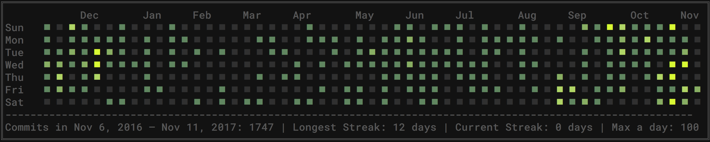
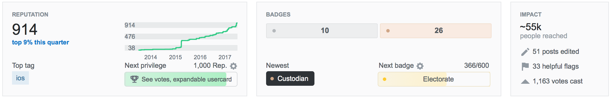

## Max von Hippel
**Site:** [mxvh.pl](http://mxvh.pl) 
**Github:** `@maxvonhippel` 

**Stack Overflow:** `uid=1586231`

**Experience**

* **NASA** `|` University of Arizona Space Grant Intern `09/17` - `06/18`
	* Worked for Dr. Chris Harig on noise reduction & modeling on Slepian `MATLAB` project, which projects [GRACE gravity data](https://grace.jpl.nasa.gov/data/get-data/) onto bases of Slepian functions of spherical harmonics in order to model the melting of the polar ice caps.
* **NAU Pathogen Microbiome Institute** `|` Undergraduate Software Engineer `06/17` - `09/17`
	* Worked for Dr. Greg Caporaso on [QIIME 2](http://qiime2.org/), a bioinformatics toolkit for microbiology.  Focused on statistics using `numpy` and `pandas` in `Python3`, and data visualization with a `React`/`Redux` stack in `ES6 Javascript` using `D3.JS`.  Built [Alpha Rarefaction visualizer](https://github.com/qiime2/q2-diversity/pull/128).
* **Kathmandu Living Labs** `|` Software Engineering Intern `10/16` - `12/16`
	* Built open-source [server](https://github.com/maxvonhippel/OSMHistoryServer) and [client](https://github.com/maxvonhippel/NepalOSMHistory) for visualization of contribution metrics for mappers on the OpenStreetMap platform in Nepal.
* **RES3D & Capture Interactive** `|` Software Engineer `10/12` - `10/17`
	* Built and helped build numerous projects in `Unity3D`, `iOS Objective-C`, `ES5 Javascript`, and `Windows C#` incorporating [natural user interfaces](https://vimeo.com/132862551) and [augmented](https://vimeo.com/194551673) and virtual reality systems for clients including [General Electric](http://mxvh.pl/GE/), [Fox Entertainment](https://www.polygon.com/2014/7/31/5946153/x-men-pacific-rim-oculus-rift-comic-con), The Muppets franchise, and BP.  RES3D and Capture Interactive were sister companies during most of my time working at both; they split apart in 2014, and I continue to subcontract on occasion for RES3D.

**Education**

* **University of Arizona - Honors College** `|` Candidate for Bachelor of Science in Mathematics & Bachelor of Science in Computer Science, GPA 4.0 `01/17` - `Present`
* **Dartmouth College** `|` Studied Mathematics & Computer Science, GPA 3.6 `11/15` - `06/16`
* **United World College Costa Rica** `|` Shelby Davis Scholar, Awarded Bilingual International Baccalaureate diploma, GPA 3.7 `08/14` - `05/15`

**References**

* Dov Margalit, CEO of RES3D: `dov@res3d.com`
* Dr. Sergey Bratus, Research Associate Professor in the Department of Computer Science at Dartmouth College: `sergey@cs.dartmouth.edu`
* Patrick Dulin, CEO of Step Away, LLC: `pldulin@hotmail.com`
* Dr. Nama Raj Budhathoki, Executive Director of Kathmandu Living Labs:
`namabudhathoki@gmail.com`
* Dr. Greg Caporaso, Principal Investigator & Associate Professor in the Pathogen Microbiome Institute at Northern Arizona University: `gregcaporaso@gmail.com`

**This Resume**

This resume is open-source.  Anyone can use, modify, and iterate on the code which built this resume free of charge.  The repository is made freely available under GNU license [here](https://github.com/maxvonhippel/resume).
